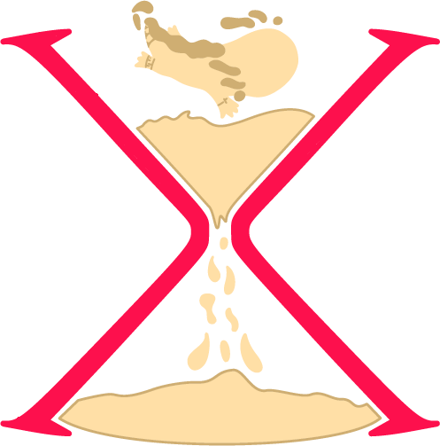
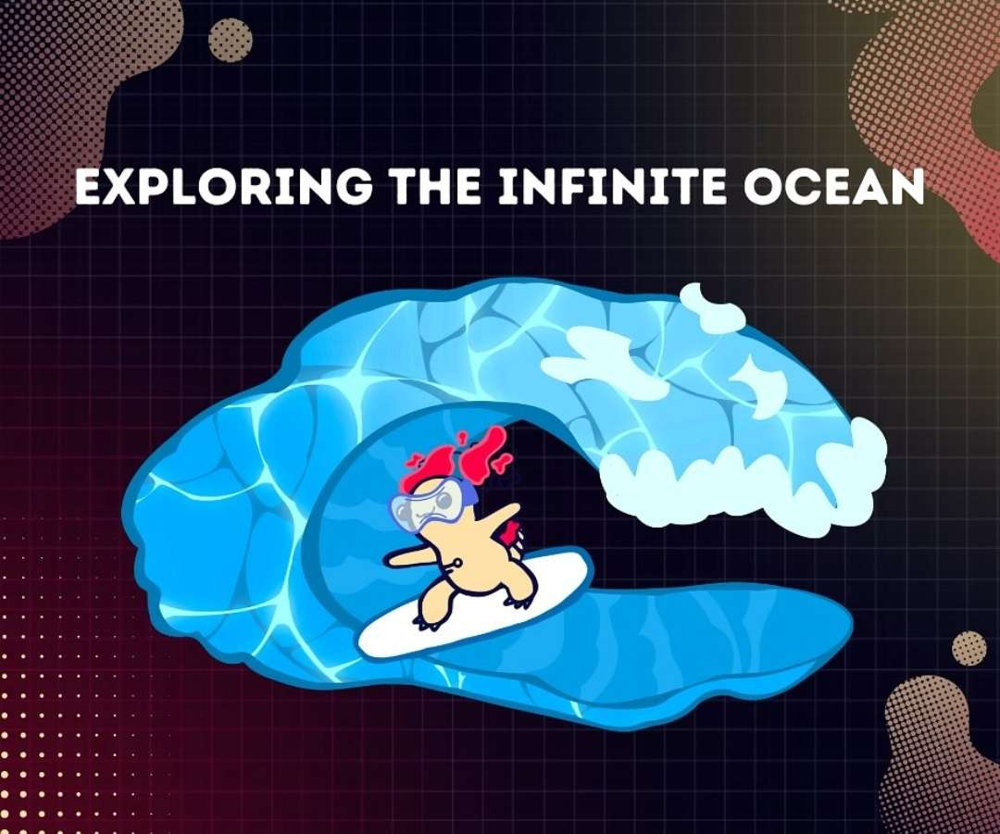
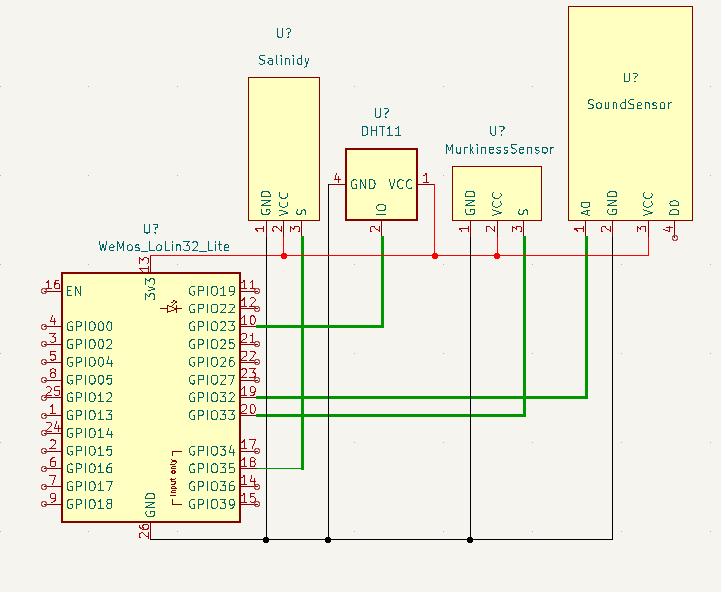

# Project for HackTUES-X
 Манджа с грозде
Нашият проект цели да подпомогне проследяване на текущо състояние и предотвратяване на бъдещи усложнения пречинени от модерното решение за охлаждане на големи центрове за съхранение на сървъри потопени във водоеми.

# Тема:

# Watervizer

Watervizer е система, която се състои от устройство за анализ на промените настъпили в екосистемата около контейнери със сървъри, които са потопени във водоеми, с цел тяхното охлаждане. За наблюдаване на данните в реално време, се използват web приложение и мобилни приложения за Android и iOS, а самото измерване се извършва посредством хардуерни модули. Изготванянето на прогнози за появите на потенциялни опасностти се осъществява с помощта на изкуствен интелект (AI), които биват визуализирани/достъпни във вече изброените приложения.

## Архитектура
### - Embeded
Хардуерът се използва за измерване на различни параметри на водата, които са избрани съобразно тяхното влияние върху здравето на флората и фауната в тази среда. Част от най-важните параметри са соленост, шум, температура и мътност.
Хардуернта част на решението е базирана на микроконтролер. Към този микроконтролер са свързани няколко на брой сензори измерващи по-горе описаните параметри. Измерванията се осъществяват посредством изчитане на стойностите V (волтаж) и A (ампераж). Събраните данни се изпращат посредством WiFi модул към сървърната (beckend) част на предложеното решение. Данните се изпращат със заявка (request) от тип POST. Като в body на заявката има всичките измервания от сензорите в Raw Format за последните 10 минути.Заявката съдържа информаця структурирана в Json format. Използването на Raw Format решава редица проблеми и има следните преимущества:
Калибрация на сензорите в сърварната среда
Намалване на изчислителната мощ на микроконтролера
По-ниска консумация на енергия  
и т.н.

### - Разработка на API и UI
Backend предоставя  API чрез което може да бъде извиквано. Програмният интерфейс (API) има за цел да извлече записаните вече данни от базата данни (Azure MySql) и да ги предостави за анализ и обработка на изкуствен интелект (AI). Така обработените данни се връщат и респективно визуализират на потребителя. След изпълнение на заявката, данните се запазват с цел бъдещ анализ и моделиране. Данните постъпващи от хардуерната част са автономен процес и не е нужно потребителят да е активен (логнат) за да се осъществи този процес.
За по-голямо улесниеие е разработено и WEB приложение, което е еквивалентно на горе описаната апликация. Поради естеството на работна среда (по-голям монитор и по-висока резолюция) данните се визуализират в по-подробен формат.

### - Обработка на данните чрез изкуствен интелект
Поради ограниченото време за разботка на проекта, е избран prompt engineering пред други по-прецизни методи. Проектът съдържа част "маниджър на задачи (task scadualer)". Целта на този модул е автономното анализиране чрез извикване на услугите на АI. Модулът стартира task, който събира последните 6 измервания от сензорите на всички сондии и извиква анализ чрез AI API. Това дава възможност да се изготви прогноза за бъдещото състояние на екосистемата в периметера на даденият контейнер. След анализ на данните, те се съхраняват в Azure MySql с цел тяхната бъдеща визуализация на устройството на крайните потребители.

### - Мобилно приложение за iOS
С цел предоставяне на удобен графичен интерфейс за потребителите е разработено мобилно приложение. За разработка е избрана технология SwiftUI. В дадения случай технологията е подходяща, тъй като позволява бърза реализация, лесна четимост на кода и различни удобства за програмиста. Апликацията има за цел да предостави на потребителите възможност за визуализация на данните, които са отчетени от хардуерната част на решението. Данните се достъпват посредством HTTP заявка (request) към backed частта на проекта.

### - Мобилно приложение за Android
Android mobile app е направен с цел услугата за следене на параметрите на водата около подводните контейнири с информация в реално време да бъде достъпнa до повече потребители. Приложенето по функционионалност е сходно с iOS mobile app.

### Части
- Микроконтролер -> ESP32 WEMOS LOLIN32 LITE
- Фоторезистор и RGB светодиод
- Температурен сензор -> DHT22
- Сензор за звук -> KY038
- Сензор за отчитане на солеността на водата (сензор за отчинате на нивото на водата) -> HW-038

### Технологии
- AI - python with prompt design tpo GPT 3.5-turbo
- Embeded -  ESP32 WEMOS LOLIN32 LITE with C/C++
- JSON 
- Backend - PHP -> Laravel - 
- Frontend - Javascript -> React
- Android - Flutter
- iOS - SwiftUI

### Отбор
 - Георги
 - Емилиана
 - Кристиян
 - Павел
 - Петя

### В бъдеще
 - Ще се използва LangChain
 - Ще се добят допълнителни сензори и подобряване на консумацията на електричество
 - Ще се добавят на нови фунционалности за подобряване на визуализацията (UI/UX)
 - Ще се подобри дизайна
 - Добавяне на различни правила за достъп при различни устройства